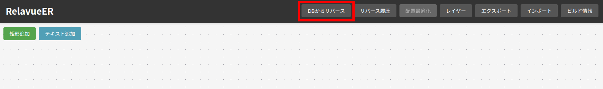
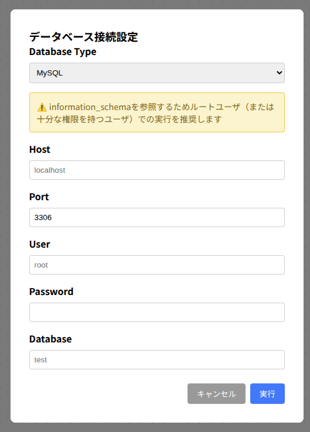

# RelavueER

RelavueER（レラビューアー）は、データベースからER図をリバースエンジニアリングし、ブラウザ上で可視化・編集できるツールです。


## 機能

### 🔄 リバースエンジニアリング

- MySQLデータベースからER図を自動生成
- 増分リバース対応（既存の配置情報を維持）
- DDL情報の保持

### 🎨 可視化・編集機能

- インタラクティブなER図表示
- エンティティのドラッグ&ドロップ配置
- ズーム・パン操作
- リレーション線の表示（直角ポリライン）
- ホバー時のハイライト表示

### 📊 詳細情報表示

- エンティティクリックでDDL表示
- サイドバーでの詳細情報表示
- プライマリキー・外部キーの視覚的区別

### ✏️ 注釈機能

- 矩形描画（エンティティのグループ化用）
- テキスト追加（補足情報記載用）
- カスタマイズ可能な色・サイズ

### 💾 データ永続化

- ER図データとレイアウト情報の保存
- Dockerボリュームによる柔軟な保存場所設定

## 🟦 使用方法

### 🟠 macOS / Windows（Docker Desktop）の場合

1. コンテナを起動する

```bash
docker run --rm -p 30033:30033 tkuni83/relavue-er
```

2. [http://localhost:30033](http://localhost:30033) にアクセスする

3.「DBからリバース」ボタンからDB接続情報を入力し実行する





**注意**: dockerコンテナから接続するためHostは`localhost`ではなく`host.docker.internal`となります。

### 🟠 Linux の場合

1. コンテナを起動する

```bash
docker run --rm --network host tkuni83/relavue-er
```

2. [http://localhost:30033](http://localhost:30033) にアクセスする

3.「DBからリバース」ボタンからDB接続情報を入力し実行する


# 開発者向け情報

[README_DEVELOP.md](README_DEVELOP.md)を参照